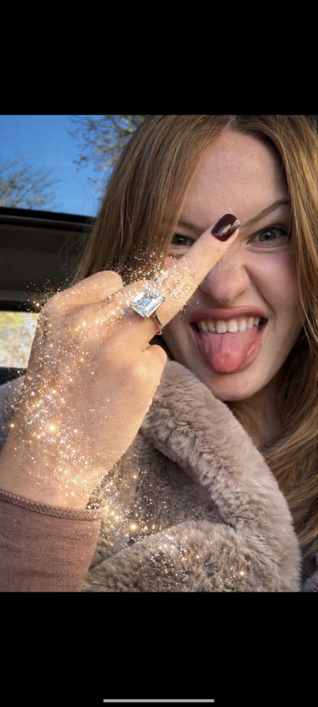

<!DOCTYPE html>
<html>
<head>
<meta charset="UTF-8">
<title>Anasta Production</title>

</head>

<body>

<!-- START SCREEN -->

<h1>ANASTA PRODUCTION</h1>

🌸 Нажми меня

<!-- ANIMATION -->

<!-- PORTFOLIO -->

<h2>Anasta — Model Portfolio</h2>

Professional model with experience in fashion, lifestyle and brand promotion.  

• Modeling experience — 3+ years 
• Brand collaborations 
• Photo & video production 
• Commercial and creative shoots 
• Social media promotion  

Open for collaborations worldwide.

<h3>@anasta.production</h3>

<a href="https://www.instagram.com/anasta.production/" target="_blank">
Open Instagram →
</a>

</body>
</html>
